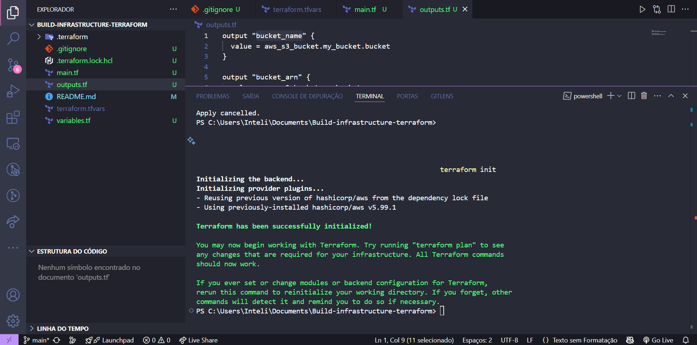
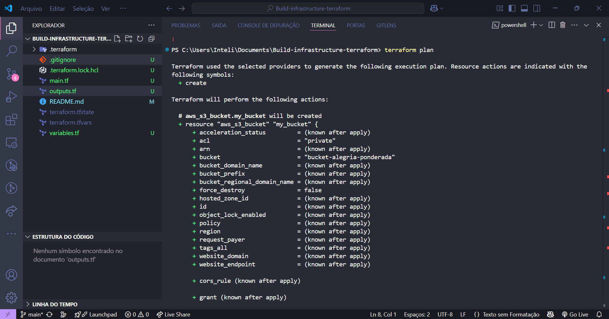
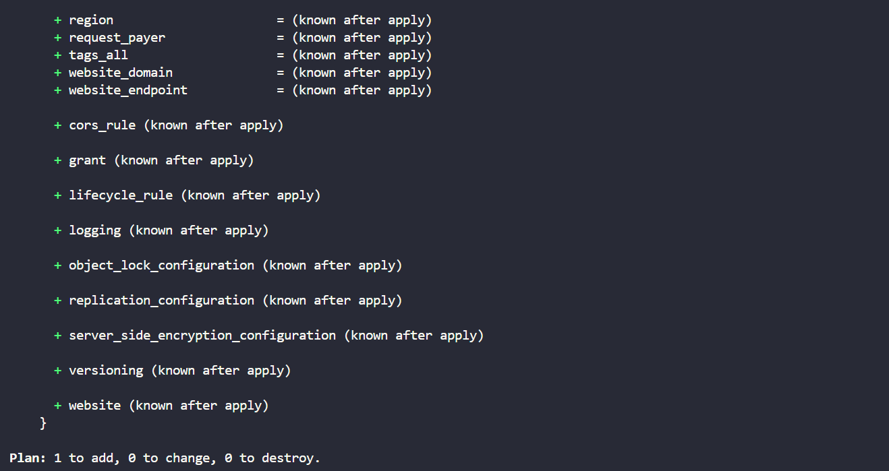
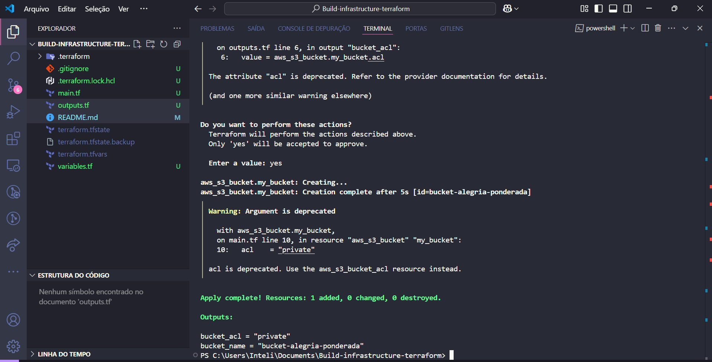
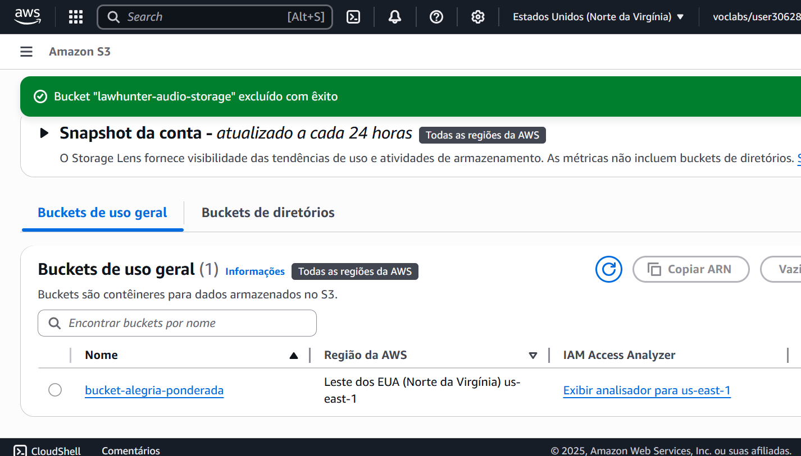

# Documentação de Provisionamento AWS com Terraform

## 1. Objetivo

O objetivo da ponderada é substituir a instância RDS por um bucket S3 no projeto Terraform existente. O bucket criado foi `bucket-alegria-ponderada`. No meu caso, eu não cheguei a iniciar o RDS, por esse motivo, não foi destruído quando realizei a substituição. 

---

## 2. Estrutura Inicial

O projeto Terraform já possuía:

- Um `main.tf` com:
  - Provedor AWS
  - Recursos para RDS (`aws_db_instance`)
  - Um grupo de segurança

- Um `outputs.tf` que exibia o endpoint da RDS e o ID do security group.

- Um `variables.tf` que define as credenciais 

---

## 3. Alterações Realizadas

1. **Removi** os recursos relacionados ao RDS:
   - `aws_db_instance`
   - `aws_security_group`

2. **Adicionei** o recurso para criação de um bucket S3 privado com ACL no `main.tf`:

```hcl
resource "aws_s3_bucket" "my_bucket" {
  bucket = "bucket-alegria-ponderada"
}

resource "aws_s3_bucket_acl" "my_bucket" {
  bucket = aws_s3_bucket.my_bucket.id
  acl    = "private"
}
```

3. **Atualizei os outputs** em `outputs.tf` para refletirem o bucket criado: 

```hcl
output "bucket_name" {
  value = aws_s3_bucket.my_bucket.bucket
}

output "bucket_acl" {
  value = aws_s3_bucket_acl.my_bucket.acl
}
```

## 4. Variáveis Sensíveis

Criei um arquivo `terraform.tfvars` com as minhas credenciais AWS: 

```hcl
region        = "us-east-1"
access_key    = "MINHA_ACCESS_KEY"
secret_key    = "MINHA_SECRET_KEY"
session_token = "MEU_SESSION_TOKEN" # incluído por estar usando sessões temporárias pelo Laboratório que o Inteli disponibiliza
```

**OBS: Esse arquivo não foi versionado para evitar exposição de informações sensíveis**

## 5. Execução dos Comandos Terraform 

1. **Inicializei o Terraform com `Terraform init`**

<div style="display: flex; justify-content: center; gap: 20px; width: auto;">
  
</div>

> Esse comando preparou o ambiente e baixou o provedor AWS.

2. **Verifiquei o plano de execução com `Terraform plan`**

<div style="display: flex; justify-content: center; gap: 20px; width: auto;">
  
</div>

<div style="display: flex; justify-content: center; gap: 20px; width: auto;">
  
</div>

> Fez a confirmação que o recurso a ser criado era o `bucket S3 bucket-alegria-ponderada`.

3. **Apliquei o plano com `Terraform apply`**

<div style="display: flex; justify-content: center; gap: 20px; width: auto;">
  
</div>

> Digitei `yes` para confirmar a criação do recurso.

## 6. Resultado do Bucket na AWS

Ao final da execução, o Terraform exibiu os outputs configurados:

```ini
bucket_name = "bucket-alegria-ponderada"
bucket_acl  = "private"
```

O bucket foi criado com sucesso e existe a confirmação visualno Console da AWS:

<div style="display: flex; justify-content: center; gap: 20px; width: auto;">
  
</div>

## 7. Conclusão

Ao final, consegui substituir o recurso de banco de dados RDS por um bucket S3 utilizando a estrutura do Terraform. 